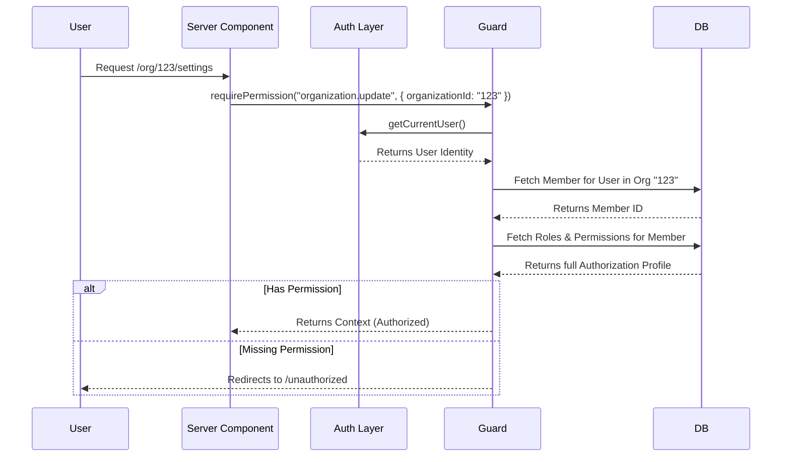
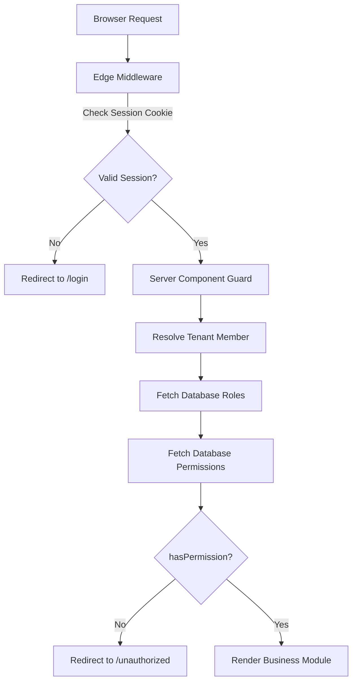

# Authorization Engine (RBAC)

This document details Phase 3 of the Growcle SaaS Platform: The Role-Based Access Control (RBAC) authorization layer.

## Why RBAC Exists
While the Authentication layer strictly verifies **"Who is this user?"** and issues them a session, it has no knowledge of business logic. The Authorization Engine exists to answer **"What is this user allowed to do?"** within a specific context (like an Organization or a Chapter).

By completely separating Authentication from Authorization, we ensure that adding new business features or complex multi-tenant hierarchies never impacts the core identity management system.

## Folder Structure

The RBAC logic is encapsulated in `src/features/authorization/`:

```text
src/features/authorization/
 ├── constants/
 │    ├── permissions.ts    # String registry of all granular resource.action permissions
 │    └── roles.ts          # Default system roles (Platform Admin, Org Admin, etc.)
 ├── repositories/
 │    └── rbac.repository.ts # Direct database queries to fetch MemberRole and RolePermission maps
 ├── services/
 │    └── authorization.service.ts # Core engine exposing hasPermission(), hasRole(), etc.
 ├── helpers/
 │    └── guards.ts         # Server-side wrappers (requirePermission, requireRole) that resolve the context
 └── types/
      └── index.ts          # Type definitions for AuthorizationContext and TenantContext
```

## Role Hierarchy & Seed Strategy

The system relies entirely on the database for roles and permissions rather than hardcoded logic. This is achieved through the `prisma/seed.ts` script which uses robust `upsert` mechanisms to safely inject the defaults:

1. **Platform Admin**: Superuser with access to all permissions globally.
2. **Organization Admin**: Manages an entire organization, chapters, and organization-wide features.
3. **Chapter Admin**: Manages a specific chapter, its meetings, attendance, and member approvals.
4. **Chapter Officer**: Assists the Chapter Admin with operational tasks (e.g., taking attendance).
5. **Member**: Standard networking member who can view directories and submit referrals.

*Organizations can eventually create custom roles without needing code changes, simply by mapping existing permission slugs to a new Role record.*

## Permission Naming Convention

Permissions use a strict `resource.action` naming convention for granularity and predictability. Examples include:
- `organization.create`
- `chapter.update`
- `member.invite`
- `meeting.delete`
- `referral.create`

## Permission Resolution Flow

When a user attempts to access a protected resource, the server relies on the Next.js App Router Server Components (Guards) to intercept the request and build the `AuthorizationContext`. 



## Authentication vs Authorization Pipeline

The complete request pipeline flows as follows:



## Development Workflow

When creating a new Business Module, developers **must not** perform manual role checks (e.g., `if (user.role === 'admin')`). Instead, they should:
1. Define a new `resource.action` permission in `permissions.ts` if one does not exist.
2. Add the permission mapping to the default roles in `prisma/seed.ts`.
3. Call `requirePermission(PERMISSIONS.RESOURCE.ACTION, tenantContext)` at the top of the Server Component or Server Action.
