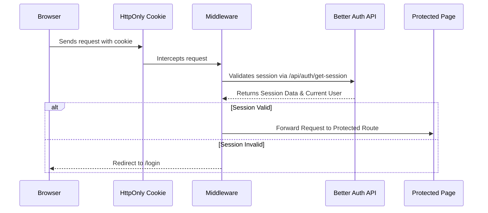
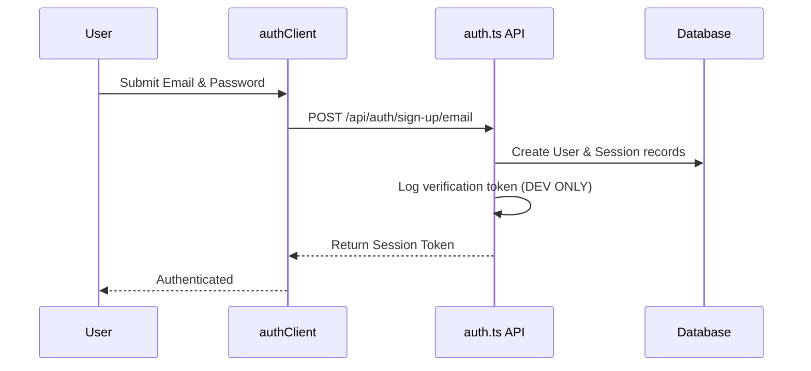
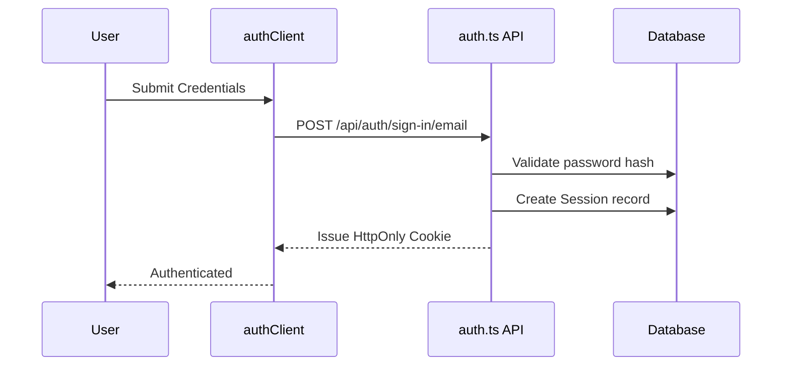
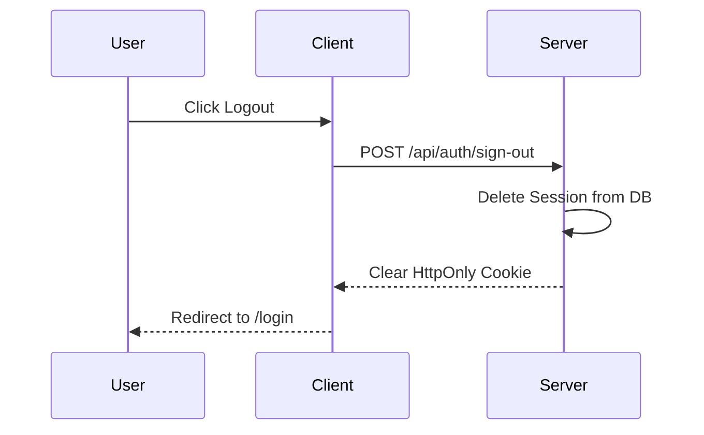

# Authentication Architecture

This document describes the foundational authentication layer for the Growcle SaaS Platform using **Better Auth**.

---

## 1. Authentication Responsibility

**Strict Separation of Concerns:**
Authentication is responsible **only** for verifying identity. It strictly handles:
- User identity management
- Login / Logout
- Registration
- Sessions & Cookies
- Email verification
- Password reset

Authentication must **never** contain logic for:
- Roles & Permissions
- Organization logic
- Chapter logic
- Workspace resolution
- Business rules

*Note: All role and permission checks belong exclusively to the Authorization (RBAC) layer, which acts as a wrapper around the authentication session.*

---

## 2. High-Level Backend Architecture

The following diagram illustrates where the Authentication layer sits within the overall backend architecture:

```text
Database (Prisma)
       ↓
Better Auth (Identity Engine)
       ↓
Authentication (Session & Identity Verification)
       ↓
RBAC (Role-Based Access Control)
       ↓
Workspace Engine (Tenant Resolution)
       ↓
Business Modules (Organizations, Chapters, Meetings, etc.)
```

---

## 3. Folder Structure

The authentication logic is modularized within `src/lib/auth/`:

```text
src/lib/auth/
 ├── config.ts   # Validates environment variables (fail-fast) and holds auth configuration.
 ├── auth.ts     # The core Better Auth server instance configured with the Prisma adapter.
 ├── client.ts   # The Better Auth frontend client (used in React components).
 ├── session.ts  # Server-side helpers (getCurrentUser, getCurrentSession, requireAuth, isAuthenticated).
 └── server.ts   # Re-exports server-side utilities for easier importing.
```

- **`src/app/api/auth/[...all]/route.ts`**: The catch-all API route that exposes Better Auth's endpoints.
- **`src/middleware.ts`**: The Edge middleware responsible for guarding protected routes.

---

## 4. Authentication Request Flow

### Cookie Traveling & Validation Flow
HttpOnly cookies are used to securely transmit the session token. They are immune to client-side JavaScript access (XSS protection). Every authenticated request passes through the middleware for validation:



### Registration Flow


### Login Flow


### Logout Flow


---

## 5. Development & Production Notes

### Email Verification & Password Resets
Currently, the application is configured to **log verification and reset tokens directly to the server console** when `NODE_ENV === "development"`. 
- This is a **temporary development implementation** to allow local testing without an SMTP server.
- In **production**, this will be replaced with a transactional email provider (such as Resend, AWS SES, or SendGrid) to actually deliver these tokens securely to the user's inbox.

### Environment Variables
The following environment variables are strictly required and validated on startup:
- `DATABASE_URL`: Connection string for PostgreSQL.
- `BETTER_AUTH_SECRET`: A secure random string for signing cookies and tokens.
- `BETTER_AUTH_URL`: The canonical URL of the application.

---

## 6. Future Authentication Roadmap

*(These are roadmap items and are NOT currently implemented)*
- **Two-Factor Authentication (2FA)**
- **Passkeys**
- **Magic Links**
- **Google OAuth / GitHub OAuth**
- **Enterprise SSO (OIDC / SAML)**
