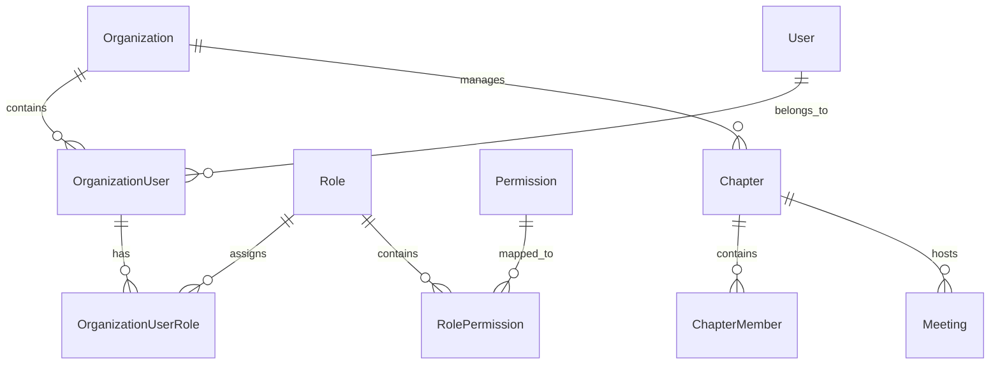

# Entity Relationship Diagram

## High-Level Overview

```mermaid
erDiagram
    Organization ||--o{ OrganizationUser : contains
    User ||--o{ OrganizationUser : belongs_to
    OrganizationUser ||--o{ OrganizationUserRole : has
    Role ||--o{ OrganizationUserRole : assigns
    Role ||--o{ RolePermission : contains
    Permission ||--o{ RolePermission : mapped_to
    Organization ||--o{ Chapter : manages
    Chapter ||--o{ ChapterMember : contains
    Chapter ||--o{ Meeting : hosts
```

*(See individual table files for detailed relationships)*\n